<div align="center">

<picture>
  <source media="(prefers-color-scheme: dark)" srcset="https://capsule-render.vercel.app/api?type=waving&color=0:0d1117,45:312e81,75:6d28d9,100:8b5cf6&height=230&section=header&text=Ewen%20Cheung&fontSize=62&fontColor=ffffff&fontAlignY=34&animation=fadeIn&desc=AI%2FML%20Engineer%20%7C%20Software%20Engineer%20%7C%20NUS%20Computer%20Science&descSize=17&descColor=c4b5fd&descAlignY=55" />
  <source media="(prefers-color-scheme: light)" srcset="https://capsule-render.vercel.app/api?type=waving&color=0:f8fafc,45:e0e7ff,75:c4b5fd,100:8b5cf6&height=230&section=header&text=Ewen%20Cheung&fontSize=62&fontColor=111827&fontAlignY=34&animation=fadeIn&desc=AI%2FML%20Engineer%20%7C%20Software%20Engineer%20%7C%20NUS%20Computer%20Science&descSize=17&descColor=4f46e5&descAlignY=55" />
  
</picture>

<a href="https://git.io/typing-svg">
  <picture>
    <source media="(prefers-color-scheme: dark)" srcset="https://readme-typing-svg.demolab.com?font=Fira+Code&weight=600&size=22&duration=2800&pause=900&color=8B5CF6&center=true&vCenter=true&multiline=true&repeat=true&random=false&width=920&height=112&lines=Building+enterprise-grade+AI+systems;Engineering+RAG%2C+Text-to-SQL%2C+and+agentic+workflows;Turning+software%2C+data%2C+and+ML+into+usable+products" />
    <source media="(prefers-color-scheme: light)" srcset="https://readme-typing-svg.demolab.com?font=Fira+Code&weight=600&size=22&duration=2800&pause=900&color=4F46E5&center=true&vCenter=true&multiline=true&repeat=true&random=false&width=920&height=112&lines=Building+enterprise-grade+AI+systems;Engineering+RAG%2C+Text-to-SQL%2C+and+agentic+workflows;Turning+software%2C+data%2C+and+ML+into+usable+products" />
    
  </picture>
</a>

<br/>


<br/>
<br/>

[](https://github.com/EwenCheung?tab=repositories)
[](https://www.linkedin.com/in/ewen-yi-wen-cheung)
[](mailto:ewen.cheung@u.nus.edu)
[](https://github.com/EwenCheung)

<br/>
<br/>


</div>

---

##  About Me

I am **Ewen Cheung Yi Wen**, a **Computer Science undergraduate at the National University of Singapore** focused on software engineering, AI systems, and full-stack product engineering. My work sits at the intersection of **backend systems, machine learning, LLM infrastructure, agentic workflows, data platforms, and production-grade user-facing applications**.

I have built and deployed systems across **RAG**, **text-to-SQL**, **vLLM inference optimisation**, **AI weather forecasting**, **private equity intelligence pipelines**, **multi-agent orchestration**, **academic planning systems**, and **pathfinding agents with CNN-based perception**. I am also deepening my ML foundation across **computer vision, diffusion models, generative modelling, and hallucination evaluation**. I care about systems that are not only intelligent, but also reliable, auditable, secure, measurable, and usable by real people.

<div align="center">

| Engineering Focus | What I Build |
| --- | --- |
| **Software Engineering** | Full-stack applications, backend APIs, database schemas, system design, testing workflows |
| **AI / ML Engineering** | RAG, text-to-SQL, model evaluation, inference optimisation, CNNs, GNNs, Transformers |
| **Product Engineering** | Responsive interfaces, user workflows, automation tools, end-to-end deployed products |
| **Enterprise AI** | Secure LLM-to-database workflows, Zero Trust-aligned access, monitoring, observability |

</div>

**Open To**

<div align="center">


<br/>
<br/>

<picture>
  <source media="(prefers-color-scheme: dark)" srcset="./.github/assets/ai-systems-flow.svg" />
  <source media="(prefers-color-scheme: light)" srcset="./.github/assets/ai-systems-flow-light.svg" />
  
</picture>

</div>

---

## Tech Stack

<div align="center">

### Languages

<picture>
  <source media="(prefers-color-scheme: dark)" srcset="https://skillicons.dev/icons?i=python,ts,js,java,c&theme=dark&perline=5" />
  <source media="(prefers-color-scheme: light)" srcset="https://skillicons.dev/icons?i=python,ts,js,java,c&theme=light&perline=5" />
  
</picture>

<br/>
<br/>


### Frontend

<picture>
  <source media="(prefers-color-scheme: dark)" srcset="https://skillicons.dev/icons?i=react,nextjs,html,css,tailwind,vercel&theme=dark&perline=6" />
  <source media="(prefers-color-scheme: light)" srcset="https://skillicons.dev/icons?i=react,nextjs,html,css,tailwind,vercel&theme=light&perline=6" />
  
</picture>

### Backend & Databases

<picture>
  <source media="(prefers-color-scheme: dark)" srcset="https://skillicons.dev/icons?i=nodejs,fastapi,postgres,mysql,mongodb,supabase&theme=dark&perline=6" />
  <source media="(prefers-color-scheme: light)" srcset="https://skillicons.dev/icons?i=nodejs,fastapi,postgres,mysql,mongodb,supabase&theme=light&perline=6" />
  
</picture>

### Cloud, DevOps & Tooling

<picture>
  <source media="(prefers-color-scheme: dark)" srcset="https://skillicons.dev/icons?i=docker,gcp,azure,aws,git,github&theme=dark&perline=6" />
  <source media="(prefers-color-scheme: light)" srcset="https://skillicons.dev/icons?i=docker,gcp,azure,aws,git,github&theme=light&perline=6" />
  
</picture>

<br/>
<br/>


</div>

---

## AI / ML Expertise

| Domain | Proficiency | Details |
| --- | --- | --- |
| **RAG Systems** | Advanced | Hybrid retrieval, lexical/vector search, grounding, document/data pipelines, enterprise query answering |
| **Text-to-SQL** | Advanced | Real-time SQL generation, enterprise data grounding, database access controls, query evaluation |
| **Agentic AI** | Advanced | Tool-using agents, multi-agent orchestration, RBAC, approval-gated execution, workflow monitoring |
| **LLM Infrastructure** | Advanced | vLLM serving, batching, latency optimisation, Langfuse/LangSmith observability |
| **Computer Vision** | Strong | CNN-based tile recognition, 21-class classification, 210K+ augmented samples, constrained model deployment |
| **Forecasting ML** | Strong | GNN encoders, Transformer latent rollouts, observation-to-forecast modelling, meteorology workflows |
| **Deep Learning Foundations** | Strong | Transformer internals, attention mechanisms, encoder-decoder training, optimisation loops, PyTorch implementation |
| **Generative AI Research** | Developing | Diffusion models, hallucination evaluation, generative model reliability, multimodal AI systems |
| **ML Evaluation** | Strong | Evaluation pipelines, model quality measurement, investment analysis consistency, performance benchmarking |
| **Full-Stack AI Products** | Strong | React/Next.js frontends, FastAPI/REST backends, PostgreSQL/Supabase, responsive product workflows |

---

## Experience

<div align="center">

<picture>
  <source media="(prefers-color-scheme: dark)" srcset="./.github/assets/experience-timeline.svg" />
  <source media="(prefers-color-scheme: light)" srcset="./.github/assets/experience-timeline-light.svg" />
  
</picture>

</div>

<br/>

### Private Equity Quantitative Strategist Intern - GIC

**Jun 2026 - Dec 2026**

Built an end-to-end private equity intelligence pipeline that transforms deal data into structured investment insights, accelerating underwriting analysis and improving evaluation consistency.

**Scope of Work**

- Developed evaluation workflows for private equity investment analysis.
- Automated repetitive underwriting and deal analysis processes.
- Generated structured, data-driven insights for investment decision-making.
- Connected software engineering, data processing, and evaluation consistency in a finance context.


### ML Research Intern, Meteorology - NEA / Climate Research (CCRS)

**May 2026 - Jun 2026**

Developed an Aardvark-inspired end-to-end AI weather forecasting pipeline using GNN encoders and Transformer latent rollouts, converting raw meteorological observations into forecast-ready latent states for seconds-to-minutes inference.

**Scope of Work**

- Built observation-to-forecast modelling workflows for meteorology.
- Used GNN encoders and Transformer latent rollouts for forecast-ready representation learning.
- Reduced forecast initialisation latency from 3-6 hours to 5 minutes.
- Replaced traditional initialisation bottlenecks with end-to-end AI inference design.


### AI/ML Engineer Intern - V-Key Pte Ltd

**May 2025 - Dec 2025**

Engineered production-grade RAG and text-to-SQL systems for enterprise data analysis, with hybrid retrieval, real-time SQL generation, inference optimisation, and Zero Trust-aligned LLM-to-database access controls.

**Scope of Work**

- Achieved 90%+ accuracy on enterprise information queries.
- Built hybrid retrieval pipelines with lexical/vector search and enterprise grounding.
- Reduced LLM response latency by 30% through vLLM inference optimisation, batching, and serving workflow improvements.
- Improved auditability and access safety for enterprise data workflows.


---

## Featured Projects

<details open>
<summary><b>One-Man Business Multi-Agent Orchestrator - Enterprise Agentic AI System</b></summary>

<br/>

A supervisor-driven, role-aware multi-agent system for solo business operations. It combines a FastAPI backend, Next.js dashboard, Supabase/PostgreSQL data layer, Telegram/web messaging, LangGraph orchestration, retrieval, policy grounding, memory, external research, risk checks, and human approval gates.

| Category | Details |
| --- | --- |
| **Stack** | Python, FastAPI, Next.js, React, Supabase, PostgreSQL, LangGraph, Docker, Telegram Webhooks |
| **Scale** | 20+ relational tables, owner/stakeholder dashboards, multi-channel messaging, seeded business data, tests and evaluation workflows |
| **Performance** | Supervisor pipeline delegates work to retrieval, policy, research, memory, and reply agents instead of relying on one unconstrained LLM pass |
| **Security** | RBAC, role-aware tool/data access, policy grounding, risk evaluation, approval-gated execution, human-in-the-loop controls |
| **Impact** | Won Best Project Award with 24/25; demonstrates enterprise-grade agent harness engineering and operational AI system design |
| **Repository** | [github.com/EwenCheung/One-Man-Business-Multi-Agent-Orchestrator-System](https://github.com/EwenCheung/One-Man-Business-Multi-Agent-Orchestrator-System) |

This is my strongest project because it shows production-style software engineering around AI: orchestration, permissions, persistence, evaluation, UI, integrations, deployment, and safety boundaries.

</details>

<details>
<summary><b>AI-DOP - Aardvark-Inspired AI Weather Forecasting Pipeline</b></summary>

<br/>

An AI weather forecasting research project inspired by Aardvark-style observation-to-forecast modelling. The repository includes encoder, processor, decoder, evaluation, end-to-end fine-tuning, WeatherBench-style evaluation, PBS training jobs, notebooks, and generated research outputs.

| Category | Details |
| --- | --- |
| **Stack** | Python, PyTorch, Transformers, NumPy, pandas, xarray, Matplotlib, Jupyter, PBS, MLflow |
| **Scale** | Encoder/processor/decoder training workflows, cached tensor pipelines, station evaluation, baseline preparation, and forecast evaluation scripts |
| **Performance** | Targets seconds-to-minutes AI inference by replacing slow forecast initialisation stages with learned observation-to-forecast components |
| **Security** | Local research pipeline with environment-based paths, reproducible scripts, and separated training/evaluation entrypoints |
| **Impact** | Bridges ML research and climate/weather infrastructure; directly aligns with NEA / CCRS meteorology work |
| **Repository** | [github.com/EwenCheung/AI-DOP](https://github.com/EwenCheung/AI-DOP) |

This is worth featuring because it is not just a concept repo: it contains real model-training, evaluation, notebook, and HPC-style workflow assets.

</details>

<details>
<summary><b>NUS Planner - Auto + AI-Powered Academic Planning Platform</b></summary>

<br/>

An AI-powered academic planning platform that generates optimised 4-year study plans in seconds. The system combines automated module data pipelines, prerequisite enforcement, exchange mapping, mutually exclusive module handling, backend validation services, structured planning endpoints, and a responsive React frontend.

| Category | Details |
| --- | --- |
| **Stack** | TypeScript, React, Next.js, Supabase, PostgreSQL, pgvector, RAG, REST APIs |
| **Scale** | Multi-year academic planning across modules, prerequisites, semester availability, and exchange mappings |
| **Performance** | Generates optimised 4-year plans in seconds using a constraint-aware planning engine |
| **Security** | Environment-based configuration, private data support, backend validation |
| **Impact** | Turns manual academic planning into an automated, explainable, interactive workflow |
| **Repository** | [github.com/EwenCheung/NUSPlanner](https://github.com/EwenCheung/NUSPlanner) |

This project represents my product engineering style: algorithmic planning, AI assistance, structured data, frontend UX, backend validation, and deployment readiness in one product.

</details>

<details>
<summary><b>CS2109S Path-Finding Agent with CNN and A* Search</b></summary>

<br/>

A hybrid AI agent for Grid Universe tasks that combines classical A* search, CNN/RNN perception, and ML-based decoding. The system handles dynamic hazards, interactive elements, power-ups, multiple objectives, and constrained model deployment.

| Category | Details |
| --- | --- |
| **Stack** | Python, PyTorch, CNNs, RNNs, A* Search, Jupyter, custom evaluation scripts |
| **Scale** | 210K+ augmented image samples, 21-class tile recognition, multi-objective grid environments |
| **Performance** | 97/100 overall score, Top 5%, 100% tile-recognition accuracy under a 2 MB model constraint |
| **Security** | Offline local execution, reproducible environment, contained model artefacts |
| **Impact** | Demonstrates integration of search, planning, perception, ML modelling, and constrained AI deployment |
| **Repository** | [github.com/EwenCheung/CS2109S-Path-Finding-Agent-with-CNN-and-A-Search](https://github.com/EwenCheung/CS2109S-Path-Finding-Agent-with-CNN-and-A-Search) |

This project is strong public proof of my ability to combine classical AI, deep learning, and practical engineering constraints into one working agent system.

</details>

<details>
<summary><b>Train a Transformer from Zero to Hero - English-Chinese NMT</b></summary>

<br/>

A from-scratch Transformer implementation for English-Chinese neural machine translation. The project implements embeddings, positional encoding, scaled dot-product attention, multi-head attention, encoder/decoder blocks, training, checkpointing, BLEU evaluation, tokenizer preparation, and interactive translation.

| Category | Details |
| --- | --- |
| **Stack** | Python, PyTorch, custom Transformer modules, SentencePiece-style tokenization, BLEU evaluation |
| **Scale** | Web-crawled English-Chinese corpus, train/dev/test datasets, tokenizer pipeline, training and translation entrypoints |
| **Performance** | Tracks validation loss and BLEU score, saves best checkpoints, supports inference through an interactive translation script |
| **Security** | Local model training/inference pipeline with explicit configs and reproducible entrypoints |
| **Impact** | Demonstrates first-principles understanding of Transformer internals rather than only using high-level model APIs |
| **Repository** | [github.com/EwenCheung/Train-a-transformer-from-zero-to-hero](https://github.com/EwenCheung/Train-a-transformer-from-zero-to-hero) |

This project is worth mentioning because it shows model-level engineering: attention, encoder-decoder architecture, optimization, training loops, and inference mechanics.

</details>

<details>
<summary><b>SuperConfig - No-Code Agentic AI Configuration Platform</b></summary>

<br/>

A no-code agentic AI configuration project built for the SimplifyNext x AWS hackathon. The platform focuses on rapid setup of personalised AI agents and workflow configuration for users who need agent capabilities without manually engineering the system from scratch.

| Category | Details |
| --- | --- |
| **Stack** | Python, AWS, agent configuration, workflow automation |
| **Scale** | Demo-oriented agent setup flow with configurable behaviour and deployment workflow |
| **Performance** | Designed for rapid configuration and fast agent setup |
| **Security** | Configuration-driven access patterns and controlled setup flow |
| **Impact** | Lowers the barrier to deploying personalised agentic AI workflows |
| **Repository** | [github.com/EwenCheung/SuperConfig](https://github.com/EwenCheung/SuperConfig) |

This project shows my interest in turning agentic AI from a research idea into a configurable product experience.

</details>

<details>
<summary><b>Dual Defence v3 - Python Tower Defense Game</b></summary>

<br/>

A comprehensive Python/Pygame tower-defense game featuring campaign modes, progression systems, user management, custom game mechanics, and replayable gameplay loops.

| Category | Details |
| --- | --- |
| **Stack** | Python, Pygame, custom game logic |
| **Scale** | Multiple modes, progression mechanics, user management, custom gameplay systems |
| **Performance** | Local game loop with responsive interaction and state-driven mechanics |
| **Security** | Local user state handling and contained runtime |
| **Impact** | Demonstrates software design, game state management, event systems, and end-to-end project completion |
| **Repository** | [github.com/EwenCheung/Dual-Defence-v3-latest](https://github.com/EwenCheung/Dual-Defence-v3-latest) |

This project demonstrates my foundation in software construction before moving deeper into AI and enterprise systems.

</details>

---

## 🎓 Education & Achievements

<table>
<tr>
<td width="58%" valign="top">

### 🏫 Education


**B.Sc. (Honours), Computer Science** — *Aug 2025 – May 2028*

> Focus Area: Artificial Intelligence & Algorithms


**Data Science & Artificial Intelligence** — *Aug 2024 – Jul 2025*

> Completed Year 1 · Credits transferred to NUS (entered as Year 2)

</td>
<td width="42%" valign="top">

### 🏆 Achievements

🥈 **2x First Runner-Up** — National Hackathons

🏅 **2x Finalist** — National Hackathons

🎖️ **Google AI CTO Bootcamp** — Selected Representative

🎯 **Top 1-5%** — NUS CS2109S (Score: 97/100)

🏆 **Best Project Award** — Multi-Agent Business Orchestrator (24/25)

🏫 **NUSSU CommIT** — Training Cell Head

</td>
</tr>
</table>

---

## GitHub Analytics

<div align="center">

<picture>
  <source media="(prefers-color-scheme: dark)" srcset="https://github-readme-stats.vercel.app/api?username=EwenCheung&show_icons=true&theme=midnight-purple&hide_border=true&bg_color=0d1117&title_color=8b5cf6&icon_color=8b5cf6&text_color=c4b5fd" />
  <source media="(prefers-color-scheme: light)" srcset="https://github-readme-stats.vercel.app/api?username=EwenCheung&show_icons=true&theme=default&hide_border=true&bg_color=ffffff&title_color=4f46e5&icon_color=7c3aed&text_color=111827" />
  
</picture>
<picture>
  <source media="(prefers-color-scheme: dark)" srcset="https://streak-stats.demolab.com?user=EwenCheung&theme=midnight-purple&hide_border=true&background=0d1117&ring=8b5cf6&fire=8b5cf6&currStreakLabel=c4b5fd" />
  <source media="(prefers-color-scheme: light)" srcset="https://streak-stats.demolab.com?user=EwenCheung&theme=default&hide_border=true&background=ffffff&ring=7c3aed&fire=7c3aed&currStreakLabel=4f46e5&sideLabels=111827&dates=4b5563&sideNums=111827&currStreakNum=111827" />
  
</picture>

<br/>

<picture>
  <source media="(prefers-color-scheme: dark)" srcset="https://github-readme-stats.vercel.app/api/top-langs/?username=EwenCheung&layout=compact&theme=midnight-purple&hide_border=true&bg_color=0d1117&title_color=8b5cf6&text_color=c4b5fd&langs_count=10" />
  <source media="(prefers-color-scheme: light)" srcset="https://github-readme-stats.vercel.app/api/top-langs/?username=EwenCheung&layout=compact&theme=default&hide_border=true&bg_color=ffffff&title_color=4f46e5&text_color=111827&langs_count=10" />
  
</picture>

</div>

---

## Contribution Activity

<div align="center">

<picture>
  <source media="(prefers-color-scheme: dark)" srcset="https://github-readme-activity-graph.vercel.app/graph?username=EwenCheung&theme=tokyo-night&hide_border=true&bg_color=0d1117&color=c4b5fd&line=8b5cf6&point=a78bfa&area=true&area_color=6d28d9" />
  <source media="(prefers-color-scheme: light)" srcset="https://github-readme-activity-graph.vercel.app/graph?username=EwenCheung&theme=github-light&hide_border=true&bg_color=ffffff&color=4b5563&line=7c3aed&point=4f46e5&area=true&area_color=c4b5fd" />
  
</picture>

</div>

---

## Contribution Snake

<div align="center">

<picture>
  <source media="(prefers-color-scheme: dark)" srcset="https://raw.githubusercontent.com/EwenCheung/EwenCheung/output/github-snake-dark.svg" />
  <source media="(prefers-color-scheme: light)" srcset="https://raw.githubusercontent.com/EwenCheung/EwenCheung/output/github-snake.svg" />
  
</picture>

</div>

---

## Current Focus

<div align="center">

<picture>
  <source media="(prefers-color-scheme: dark)" srcset="./.github/assets/focus-radar.svg" />
  <source media="(prefers-color-scheme: light)" srcset="./.github/assets/focus-radar-light.svg" />
  
</picture>

</div>

<br/>

```yaml
Learning:
  - Advanced LLM evaluation and agent reliability
  - Secure AI systems for enterprise data workflows
  - Forecasting models with GNNs and Transformer latent rollouts
  - Computer vision beyond classification: detection, segmentation, and representation learning
  - Diffusion models and generative modelling fundamentals

Building:
  - Private equity intelligence and evaluation pipelines at GIC
  - AI weather forecasting pipelines with NEA / CCRS
  - Full-stack AI products with reliable backend infrastructure

Exploring:
  - Applied AI for finance and investment intelligence
  - Agentic AI orchestration and tool-use reliability
  - Hallucination detection, grounding, and evaluation
  - Machine learning systems for CV, generative AI, and forecasting
  - RAG quality measurement and text-to-SQL auditability

Open To:
  - AI / ML engineering roles
  - Software engineering internships
  - Applied ML research collaborations
  - Full-stack AI product projects
```

---

## Connect

<div align="center">

[](mailto:ewen.cheung@u.nus.edu)
[](https://www.linkedin.com/in/ewen-yi-wen-cheung)
[](https://github.com/EwenCheung)
[](https://github.com/EwenCheung?tab=repositories)

</div>

---

<div align="center">

💡 **_"Coding is the process of building things from 0 to visible."_**

<picture>
  <source media="(prefers-color-scheme: dark)" srcset="https://capsule-render.vercel.app/api?type=waving&color=0:0d1117,45:312e81,75:6d28d9,100:8b5cf6&height=120&section=footer&animation=twinkling" />
  <source media="(prefers-color-scheme: light)" srcset="https://capsule-render.vercel.app/api?type=waving&color=0:f8fafc,45:e0e7ff,75:c4b5fd,100:8b5cf6&height=120&section=footer&animation=twinkling" />
  
</picture>

</div>
