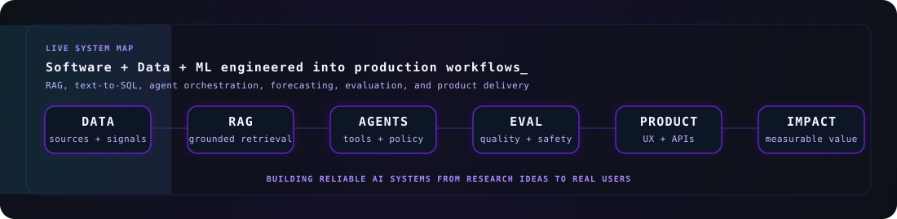
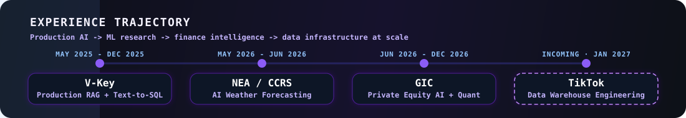

<picture>
  <source media="(prefers-color-scheme: light)" srcset="https://capsule-render.vercel.app/api?type=waving&color=0:ede9fe%2C45:c4b5fd%2C75:a78bfa%2C100:8b5cf6&height=230&section=header&text=Ewen%20Cheung&fontSize=62&fontColor=1e1b4b&fontAlignY=34&animation=fadeIn&desc=AI%2FML%20Engineer%20%7C%20Data%20%26%20Software%20Engineer%20%7C%20NUS%20Computer%20Science&descSize=17&descColor=4c1d95&descAlignY=55" />
  
</picture>

 

-000000?style=for-the-badge&logo=tiktok&logoColor=white)

-003D7C?style=for-the-badge&logo=academia&logoColor=white)

 

---

##  About Me

I'm **Ewen**, a **Computer Science (AI) undergraduate at NUS**. I build AI systems that have to work in production: **RAG and text-to-SQL** over enterprise data, **multi-agent orchestration** with real permission boundaries, **evaluation frameworks** that catch regressions, and the **data pipelines** underneath all of it.

- 🔭 **Now:** Private Equity Quantitative Strategist Intern at **GIC** — entity-resolution middleware, RAG insight pipelines, and agent evaluation on Arize
- 🚀 **Next:** Incoming **Data Warehouse Engineer Intern at TikTok** (January 2027)
- 🏆 2x First Runner-Up and 2x Finalist in national hackathons · Best Project Award · Top 5% in NUS CS2109S
- 💬 Ask me about agent harnesses, LLM evaluation, RAG, or Bayesian search

 
<picture>
  <source media="(prefers-color-scheme: light)" srcset="./.github/assets/ai-systems-flow-light.svg" />
  
</picture>

---

## Experience

<picture>
  <source media="(prefers-color-scheme: light)" srcset="./.github/assets/experience-timeline-light.svg" />
  
</picture>

### 🔜 Data Warehouse Engineer Intern — TikTok
**Incoming · Starting January 2027**

### Private Equity Quantitative Strategist Intern — GIC
**Jun 2026 – Dec 2026**

- Architected a **centralised entity-resolution middleware** for a PE data platform: BFS graph traversal deterministically maps company, fund, and deal IDs across **10+ internal tools**, giving AI agents one verified lookup with **100% mapping accuracy**.
- Built a **RAG insight pipeline** over IC memos and GP reports that orchestrates internal quant tools, cutting analyst time-to-insight from **hours to under 5 minutes**.
- Designed **trace- and system-level evaluation on Arize**: LLM-as-judge against a golden dataset plus deterministic checks on quantitative outputs, replacing black-box debugging with automated regression detection.

### ML Research Intern, Meteorology — NEA / Climate Research (CCRS)
**May 2026 – Jun 2026**

- Built an **Aardvark-inspired** end-to-end AI weather forecasting pipeline with **GNN encoders** and **Transformer latent rollouts**.
- Cut forecast initialisation latency from **3–6 hours to 5 minutes** by replacing NWP data assimilation with an observation-to-forecast model.

### AI/ML Engineer Intern — V-Key
**May 2025 – Dec 2025**

- Shipped a production **RAG + text-to-SQL** system with hybrid retrieval and enterprise data grounding at **90%+ query accuracy**.
- Reduced LLM latency by **30%** through **vLLM** inference, batching, and serving optimisation, with **Zero Trust**-aligned LLM-to-database access controls.

---

## Featured Projects

<table>
<tr>
<td width="50%" valign="top">

### 🎯 [BayesPilot](https://github.com/EwenCheung/BayesPilot)
**TikTok TechJam 2026 · Team Lead**

Conversational shopping agent that finds 1 product in a **50,000-item** catalog in ~2 turns, framed as sequential **Bayesian inference** with an expected-utility questioning policy tuned via Optuna TPE.

**0.9744** score vs 0.1067 baseline (**9x**) · 100% Hit@10 · 0.994 MRR · **7.8 ms**, **zero LLM calls**

[Live demo](https://ewencheung.github.io/BayesPilot/)

`Python` `NumPy` `Optuna` `Bayesian inference`

</td>
<td width="50%" valign="top">

### 🤖 [One-Man Business Multi-Agent Orchestrator](https://github.com/EwenCheung/One-Man-Business-Multi-Agent-Orchestrator-System)
**Best Project Award · Lead Architect**

Full-stack agentic platform for solo business owners: **LangGraph** supervisor with 5 tool-calling sub-agents, 23 tools, and RBAC across 5 stakeholder roles, plus two-stage AI security guardrails over hybrid RAG.

**90.9%** verdict accuracy · **0%** hallucinated citations across 104 tests

`LangGraph` `FastAPI` `Next.js` `Supabase` `Docker`

</td>
</tr>
<tr>
<td width="50%" valign="top">

### 🧭 [Pathfinding Agent: CNN + A*](https://github.com/EwenCheung/CS2109S-Path-Finding-Agent-with-CNN-and-A-Search)
**Solo · Top 5%**

PyTorch CNN trained from scratch to **100%** accuracy on 30-class tile recognition (210K generated images), compressed from **4.8 MB to 1.1 MB** to fit a 2 MB limit, and fused into an A* planner.

**97/100** (class mean 62.3) · won all 12 evaluation levels

`PyTorch` `CNN` `A* search` `scikit-learn`

</td>
<td width="50%" valign="top">

### 🌦️ [AI-DOP: AI Weather Forecasting](https://github.com/EwenCheung/AI-DOP)
**Research · NEA / CCRS**

Aardvark-style observation-to-forecast pipeline: encoder / processor / decoder training, end-to-end fine-tuning, WeatherBench-style evaluation, and PBS jobs on HPC.

`PyTorch` `GNNs` `Transformers` `xarray` `MLflow`

</td>
</tr>
<tr>
<td width="50%" valign="top">

### 🎓 [NUS Planner](https://github.com/EwenCheung/NUSPlanner)
**AI academic planner**

Generates constraint-valid 4-year study plans in seconds: prerequisite enforcement, exchange mappings, and mutually exclusive modules, with a RAG assistant on pgvector.

[Demo video](https://www.youtube.com/watch?v=x8QrYZg1saw)

`TypeScript` `Next.js` `Supabase` `pgvector`

</td>
<td width="50%" valign="top">

### 🧠 [Transformer from Zero to Hero](https://github.com/EwenCheung/Train-a-transformer-from-zero-to-hero)
**From-scratch English→Chinese NMT**

Every piece hand-written in PyTorch: positional encoding, multi-head attention, encoder/decoder blocks, training loop, checkpointing, and BLEU evaluation.

`PyTorch` `Transformers` `NLP`

</td>
</tr>
</table>

<b>More projects</b>

 

| Project | What it is | Stack |
| --- | --- | --- |
| [SuperConfig](https://github.com/EwenCheung/SuperConfig) | No-code agentic AI configuration platform (SimplifyNext x AWS hackathon) · [demo](https://youtu.be/1rxBVJqMaF0?t=98) | Python, AWS |
| [Code to Give: NightOwls](https://github.com/EwenCheung/Team1-NightOwls-PassionToServeUltimateSolution) | Learning platform with an AI teacher and AI notes · [live](https://code-to-give-frontend-omega.vercel.app/) | Vue, Express, FastAPI, Supabase |
| [Startup Hunter](https://github.com/EwenCheung/Startup-Hunter) | Autonomous agent platform that turns market insights into deployed MVPs | Next.js, FastAPI |
| [NUS MealExchange](https://github.com/EwenCheung/NUS-MealExchange) | Peer-to-peer meal credit marketplace with escrow and real-time chat | React, TypeScript, Supabase |
| [InternLink](https://github.com/EwenCheung/SC2006-InternLink) | Student internship platform using OneMap and LightCast skills APIs | JavaScript, Node.js |
| [BTO Management System](https://github.com/EwenCheung/SC2002-BTO-Management-System) | OOP-designed HDB BTO application system | Java |
| [Dual Defence v3](https://github.com/EwenCheung/Dual-Defence-v3-latest) | Tower-defense game with campaign mode and progression | Python, Pygame |

---

## Tech Stack

**AI / ML**

**Languages**

<picture>
  <source media="(prefers-color-scheme: light)" srcset="https://skillicons.dev/icons?i=python%2Cts%2Cjs%2Cjava%2Cc&theme=light" />
  
</picture>

**Data, Backend & Cloud**

<picture>
  <source media="(prefers-color-scheme: light)" srcset="https://skillicons.dev/icons?i=postgres%2Cmysql%2Cmongodb%2Csupabase%2Credis%2Cfastapi%2Cnodejs&theme=light" />
  
</picture>
 
<picture>
  <source media="(prefers-color-scheme: light)" srcset="https://skillicons.dev/icons?i=docker%2Cgcp%2Caws%2Cazure%2Cgithubactions%2Clinux&theme=light" />
  
</picture>

**Frontend**

<picture>
  <source media="(prefers-color-scheme: light)" srcset="https://skillicons.dev/icons?i=react%2Cnextjs%2Ctailwind%2Cvercel&theme=light" />
  
</picture>

---

## 🎓 Education & Achievements

<table>
<tr>
<td width="55%" valign="top">

**National University of Singapore**
BComp (Hons) Computer Science, Focus Area in AI · *Expected May 2028*

**Nanyang Technological University**
Data Science & AI, Year 1 · *Aug 2024 – Jul 2025* · credits transferred to NUS

</td>
<td width="45%" valign="top">

🥈 **2x First Runner-Up**, national hackathons
🏅 **2x Finalist**, national hackathons
🏆 **Best Project Award**, Multi-Agent Orchestrator
🎯 **Top 5%**, NUS CS2109S (97/100)
🎖️ **Google AI CTO Bootcamp**, selected representative
🏫 **NUSSU CommIT**, Training Cell Head

</td>
</tr>
</table>

---

## GitHub Activity

<picture>
  <source media="(prefers-color-scheme: light)" srcset="https://streak-stats.demolab.com?user=EwenCheung&theme=default&hide_border=true&background=ffffff&ring=7c3aed&fire=7c3aed&currStreakLabel=6d28d9" />
  
</picture>

<picture>
  <source media="(prefers-color-scheme: dark)" srcset="https://raw.githubusercontent.com/EwenCheung/EwenCheung/output/github-snake-dark.svg" />
  <source media="(prefers-color-scheme: light)" srcset="https://raw.githubusercontent.com/EwenCheung/EwenCheung/output/github-snake.svg" />
  
</picture>

---

💡 **_"Coding is the process of building things from 0 to visible."_**

<picture>
  <source media="(prefers-color-scheme: light)" srcset="https://capsule-render.vercel.app/api?type=waving&color=0:ede9fe%2C45:c4b5fd%2C75:a78bfa%2C100:8b5cf6&height=120&section=footer&animation=twinkling" />
  
</picture>

